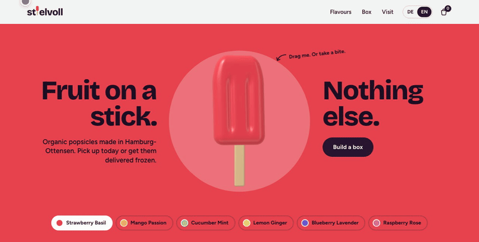
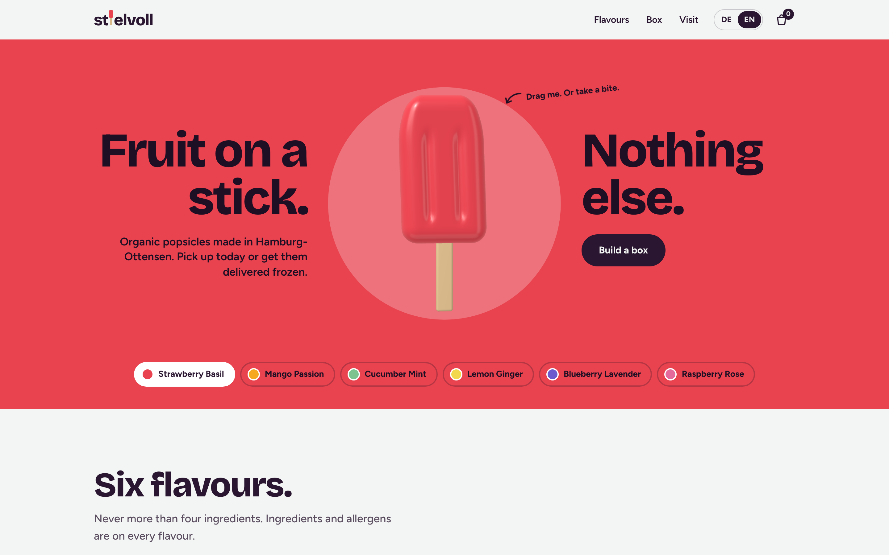
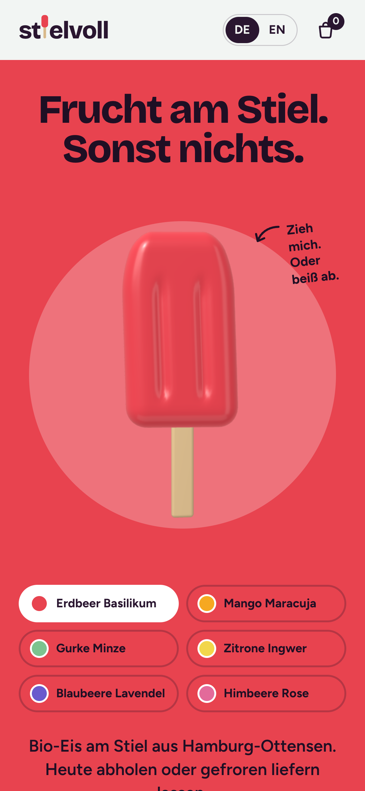
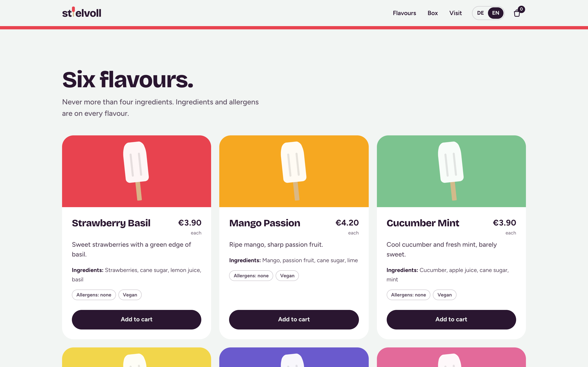
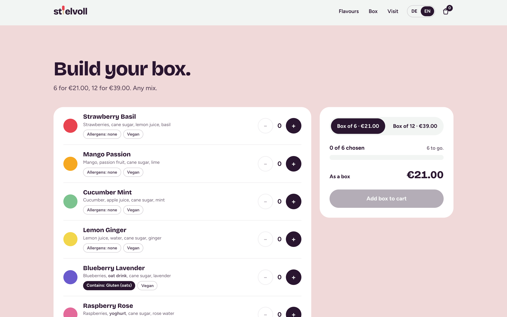
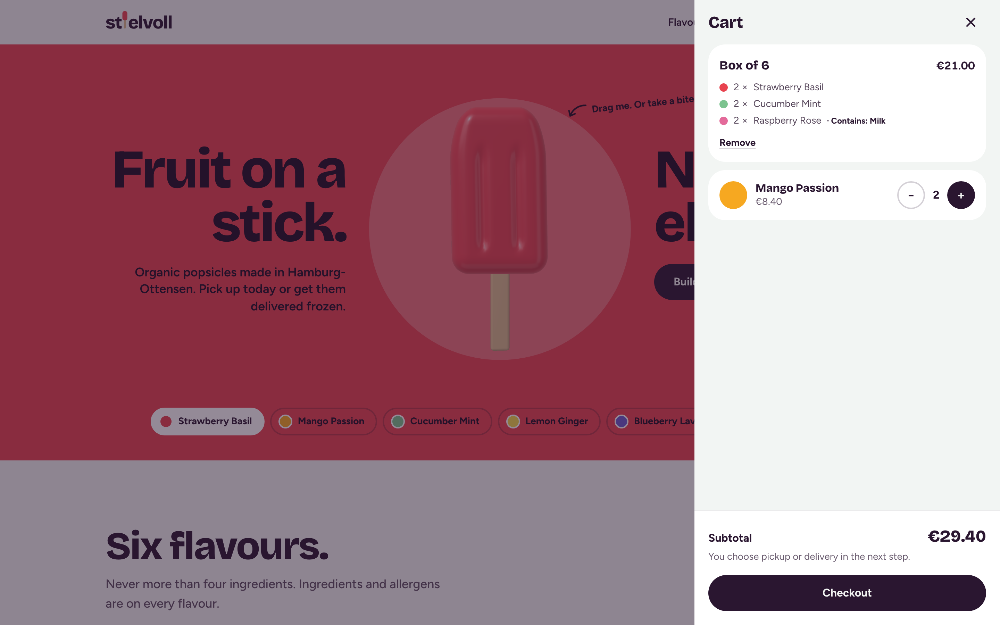
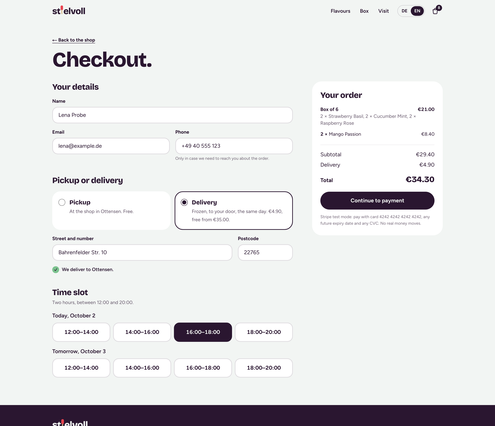
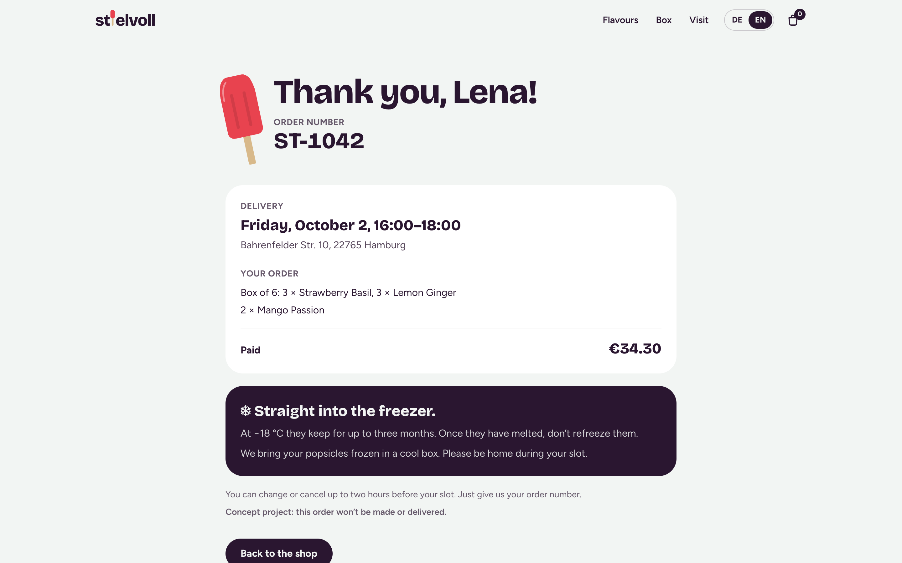
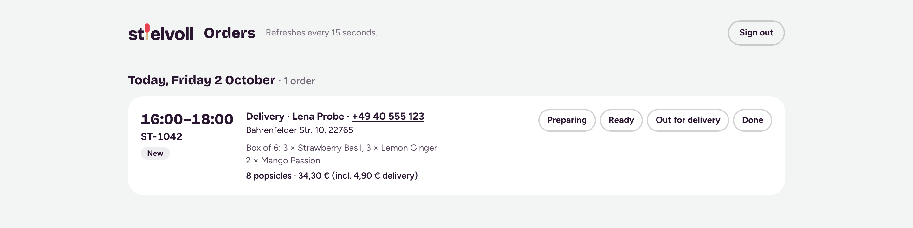

# Stielvoll

**Fruit on a stick. Nothing else.**

Stielvoll is a concept website for an organic popsicle shop in Hamburg-Ottensen, available in
German and English. Its centrepiece is a soft-body 3D popsicle in the hero: drag it and it
wobbles like jelly before settling back; tap it and you take a bite out of it.

> Stielvoll is a concept brand created for a portfolio project. There is no real
> certification, and no real orders are taken.



*Drag it and it wobbles; tap it and you take a bite.*

---

## Contents

- [Screenshots](#screenshots)
- [Features](#features)
- [Tech stack](#tech-stack)
- [Getting started](#getting-started)
- [Project structure](#project-structure)
- [Ordering](#ordering)
- [Deploying](#deploying)

## Screenshots

| Hero | Mobile, in German |
| --- | --- |
|  |  |
| **Flavours** | **Box builder** |
|  |  |
| **Cart** | **Checkout** |
|  |  |
| **Confirmation** | **Orders page** (`/admin`) |
|  |  |

## Features

- **Jelly hero.** A rounded ice-lolly bar, simulated as a spring lattice, that you can grab and
  fling with a mouse or finger. It wobbles three to four times before coming to rest.
- **Take a bite.** Tapping the popsicle bites a chunk out of it, tooth marks included, up to
  eight bites. A "Fresh one" button brings back a whole popsicle.
- **Six flavours.** Each card lists the ingredients in order of quantity, highlights allergens
  as EU labelling expects, and marks vegan flavours. Choosing a flavour recolours the hero.
- **Box builder.** Mix a box of 6 or 12 popsicles in any combination and see what you save
  compared with buying them one by one.
- **Cart drawer.** Singles and boxes, with quantity controls, allergen notes and a subtotal.
  The cart is kept in the browser, so it survives a reload. Items fly into the cart icon when
  you add them.
- **Content sections.** How ordering works, what goes into the popsicles, opening hours,
  pickup and same-day delivery districts, and an FAQ.
- **Checkout.** Pickup or same-day delivery (by postcode, €4.90, free from €35), a two-hour
  slot today or on the next opening day, then Stripe Checkout in test mode. A confirmation page
  shows the order number (ST-1042 …), the slot and a keep-frozen tip.
- **Orders page.** `/admin`, behind a password: paid orders by day and slot, with status
  buttons (Preparing, Ready, Out for delivery, Done). It refreshes every 15 seconds.
- **Error states.** Full slots, postcodes outside the delivery area, cancelled payments, a
  localised 404 and an error page.
- **Two languages.** German at `/`, English at `/en`, with every piece of copy translated.
- **Share-ready.** Per-language titles, Open Graph and Twitter tags, a generated share image,
  `hreflang` alternates, `robots.txt` and `sitemap.xml`.

## Tech stack

| Area | Choice |
| --- | --- |
| Framework | [Next.js 16](https://nextjs.org) (App Router) with React 19 |
| Language | TypeScript |
| 3D | [three.js](https://threejs.org), [@react-three/fiber](https://r3f.docs.pmnd.rs) and [@react-three/drei](https://drei.docs.pmnd.rs) |
| Physics | A small hand-written soft-body solver (`src/lib/jelly.ts`) |
| Animation | [Motion](https://motion.dev) |
| Styling | [Tailwind CSS 4](https://tailwindcss.com) |
| i18n | [next-intl](https://next-intl.dev) |
| Payments | [Stripe Checkout](https://stripe.com/docs/payments/checkout), test mode only |
| Orders | [Supabase](https://supabase.com) (Postgres) |
| Linting | ESLint 9 with `eslint-config-next` |

## Getting started

You need Node.js 20 or newer.

```bash
npm install
cp .env.example .env.local   # then fill in what you have
npm run dev       # German at http://localhost:3000, English at http://localhost:3000/en
```

With no keys at all the shop still works end to end: orders skip payment (demo mode) and are
kept in memory until the server restarts. Set `ADMIN_PASSWORD` to open `/admin`.

Other scripts:

```bash
npm run build     # production build
npm run start     # serve the production build
npm run lint      # run ESLint
```

## Project structure

```
messages/
  de.json, en.json          All copy, in German and English
src/
  app/
    [locale]/layout.tsx     Root layout per language: fonts, metadata, providers
    [locale]/page.tsx       The shop page, assembled from the sections below
    globals.css             Tailwind setup and the colour palette
    icon.svg                Favicon
  components/
    Hero.tsx                Hero, flavour chips, and the still fallback when 3D is off
    JellyPopsicle.tsx       The 3D popsicle: geometry, material, dragging and biting
    PopsicleStill.tsx       Flat SVG popsicle, used as fallback and in the cart animation
    Flavours.tsx            Flavour cards with ingredients and allergens
    BoxBuilder.tsx          Pick a box size and fill it
    CartDrawer.tsx          The cart panel
    FlyLayer.tsx            Mini popsicles that fly into the cart icon
    Sections.tsx            How it works, About, Visit, FAQ
    Header.tsx, Footer.tsx, Logo.tsx, Tags.tsx
    FlavourProvider.tsx     The currently selected flavour, shared across the page
    hooks.ts                useCart, useMoney, useLocalised
    CheckoutForm.tsx        Details, pickup or delivery, slot picker, order summary
    LocaleSwitch.tsx        DE / EN, keeping the current page
  app/
    [locale]/checkout       Checkout page
    [locale]/order/[number] Confirmation (needs the ?s= link from checkout)
    [locale]/opengraph-image.tsx  Share image per language
    admin/                  Orders page, sign-in and status actions
    api/checkout            Validates the order, prices it, opens Stripe Checkout
    api/slots               Bookable slots and which are full
    api/stripe/webhook      Marks orders paid; frees the slot when a session expires
  data/shop.ts              Flavours, box prices, delivery postcodes and slot rules
  lib/
    jelly.ts                The soft-body simulation (pure maths, no three.js)
    cart.ts                 Cart contents, sums and persistence
    order.ts                Order types and order lines
    slots.ts                Slots in shop time (Europe/Berlin)
    server/                 Env, Stripe, order storage, admin sign-in, rate limit (server only)
supabase/schema.sql         The orders table
docs/                       README screenshots
```

## Ordering

- Prices are always worked out on the server from `data/shop.ts`; the browser only says what
  is in the cart.
- Slots are 12–14, 14–16, 16–18 and 18–20, at least an hour ahead, for today and the next
  opening day (the shop is closed on Mondays). Each slot takes six orders; unpaid orders hold
  their place for the 30 minutes a Stripe session stays open. The slot is counted again after
  an order is saved, so orders placed at the same moment can't overfill it. The April-to-October season is
  not enforced, so the demo works all year.
- Delivery postcodes: 22763, 22765 (Ottensen), 22767, 22769 (Altona), 20253–20259
  (Eimsbüttel), 20357 (Sternschanze), 20359 (St. Pauli), 20457 (HafenCity).
- Each visitor can place five orders in ten minutes, so a script can't hold every slot. The
  count is kept per server instance.
- The confirmation link carries the Stripe session id, so order numbers alone can't be used to
  look up someone's details.

## Deploying

1. **Supabase.** Create a project and run `supabase/schema.sql` in the SQL editor. Copy the
   project URL and the service role key.
2. **Stripe.** In test mode, copy the secret key (`sk_test_…`). Add a webhook endpoint for
   `https://<your-site>/api/stripe/webhook` with the events `checkout.session.completed`,
   `checkout.session.async_payment_succeeded` and `checkout.session.expired`, and copy its
   signing secret. Locally: `stripe listen --forward-to localhost:3000/api/stripe/webhook`.
3. **Vercel.** Import the repository and set the variables from `.env.example`. Pay with
   card 4242 4242 4242 4242, any future date and any CVC.

If the webhook is late, the confirmation page asks Stripe directly, so the visitor never waits.
